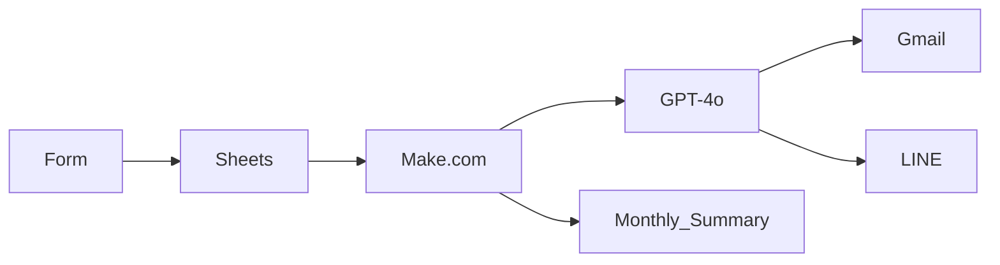

#### clinic-salary-automation
# Clinic Salary Automation System

> Automates messy attendance tracking and salary calculations using Google Sheets, Make.com, and ChatGPT. Built for a real multi-department clinic to reduce admin burden, improve payroll accuracy, and generate AI-powered summaries.

### Why I Built This

As someone helping manage a physical therapy, dental, and aesthetic clinic with my sisters, I experienced firsthand how time-consuming and error-prone it can be to manually track staff attendance and calculate salaries. So in order to reduce the workload and improve efficiency, 

I wanted to build a system that would:
- Streamline daily operations
- Reduce manual admin work through automation
- Ensure payroll accuracy across departments and shift types
- Save time for strategic decision-making and minimize human error
- Let me explore ChatGPT integration and no-code tools like Make.com in a real-world solution
- Convert messy, inconsistent time data into reliable insights

This wasn’t just a technical project — it was an operational challenge I chose to take on to improve our family-run clinic, and an opportunity to bring automation and AI into practical, small-business settings. This project became both a **practical solution** for the clinic and my **personal learning journey** in automation, systems thinking, and AI-powered reporting. 

This project also gave me the opportunity to:
- Apply and refine automation logic in real scenarios  
- Explore no-code platforms alongside AI integration
- Work directly with real operational data from a live clinic  
- Build a system that combines technical implementation with business impact
  
### Project Overview
This project aims to automate the internal tracking of staff working hours, calculate monthly salaries, and summarize clinic income using Google Forms, Google Sheets, Make.com, N8N and ChatGPT. The automation helps to reduce manual tasks, increase transparency, and allow for quicker decision-making.

### Project Scope and Goals
#### Objective
- Automate salary calculations for both medical and admin staff using submitted working hours, OT, and lateness.
- Summarize monthly and yearly clinic income using staff service records.
- Leverage automation and AI to reduce manual admin tasks, minimize errors, and improve payroll accuracy.

### Focus Areas
1. **Staff Salary Automation**
- Collect working hour submissions via Google Forms
- Different rules for different roles (e.g., hourly + commission)
- Automatically calculate salary totals
- Generate staff-specific monthly summaries
2. **Clinic Income Automation**
- Collect service income data (daily/monthly)
- Summarize income by staff, service type, or date
- Optionally use ChatGPT to generate a report like:
  > “In June, total clinic revenue was 84,200 Baht. Dr. A contributed 48,000 Baht (57%).”
---
### Impact

- Saved 8+ hours/month of manual salary calculation
- Reduced human error in attendance-based payroll
- Built real-time, scalable backend for a growing clinic team
- Adaptable to other small-medium businesses needing HR automation

---
### System Architecture
> End-to-end data and automation flow using no-code and AI.

---
### Sample Data Structure
The system relies on multiple structured Google Sheets to separate concerns:
#### 1. `raw_attendance`
Stores daily attendance and shift info from Google Forms or manual entry.

| emp_ID | day | month | year | full_name | check_in | check_out | OT_min | late_min |
|--------|--------|-------|----|--------------|-----------|------------|--------|----------|
| EMP001 | 01     | 1     | 2023 | Warit Sritong | 09:05 | 18:30 | 90     | 5        |
---
#### 2. `staff_profile`
Reference sheet for employee details and fixed salary components.

| emp_ID | nick_name | position | salary | allowance | meal_allowance |
|--------|----------|-------------|-----------|------------|----------|
| EMP001 | Por      | Cleaner      | 10,000     | 500       | 500      |
---

#### 3. `monthly_sum_attendance`
Aggregates total OT, lateness, and working days per staff per month.

| emp_ID | month | year | sum total_OT_min | sum late_min | count_days |
|--------|--------|----|-------------------|---------------|---------------|
| EMP001 | 1     | 2023 | 884               | 1             | 26            |
---

#### 4. `monthly_salary_sum`
Final salary calculations and summaries after formulas and GPT integration.

| emp_ID | month | year | nickname | OT_pay | late_deductions | total_salary |
|--------|--------|----|-------|--------|------------------|---------------|
| EMP001 | 1     | 2023 | Por   | 884 | -1.00           | 10,550   |
---
> All sheets are connected through Make.com automation and processed for GPT-based summary delivery via email or LINE.
> This project simulates real-world payroll processing based on structured attendance data from a functioning clinic. While actual payroll figures may include unrecorded manual adjustments, the system demonstrates scalable logic and automation workflows that:
> - Calculate OT and lateness deductions
> - Generate GPT-powered monthly summaries
> - Lay a foundation for further HR and business insights
---

### Workflow 
1. Staff check in/out data is exported fingerprint time clocks in .csv format
2. Raw data stored in Google Sheets → transformed into monthly summaries
3. Make.com watches the sheet, calculates salary & OT based on rules, aggregates monthly income
4. ChatGPT summarizes results in prefered language used in the organization
5. Summarize, report or message sent to HR via email / LINE

### Tech Stack & Tools
- *Google Forms* – Input working hours & treatment info
- *Google Sheets* – Central data storage & calculations
- *Make.com* — no-code workflow automation
- *ChatGPT API* — summary generation
- *LINE* — automatic message delivery
- *Gmail* — automatic email delivery
- *[Optional] Google Apps Script* – Custom logic (e.g., timestamp, validation)
- *[Optional] Looker Studio* – Visual income dashboard

### Monthly Summary Sheet
This sheet summarizes each staff's OT, lateness, and total salary, calculated automatically.
.png)
.png)
---
###  Data Privacy Note
> All datasets used in this repository are anonymized or simulated. No real personal, financial, or patient information is shared publicly in this project. The real implementation is deployed privately.
---

### Current Status
- [x] Project planning
- [x] Google sheet structure drafted
- [x] Sheet formulas tested
- [x] Make.com workflow operational
- [x] ChatGPT integration complete
- [ ] Income branch in development
- [ ] GitHub Pages site WIP

### 💡 What I Learned

- Designing scalable automation flows with Make.com
- Structuring logic for salary rules using formulas
- Integrating AI with business data for dynamic reports
- Communicating complex automation to others

---
#### .gitignore (Python-Based)
Your current `.gitignore` might look like this if you're using Python for any part of the automation:

