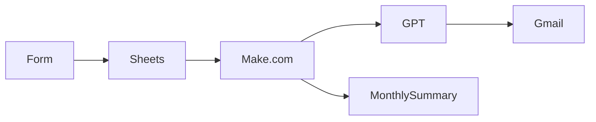

#### clinic-salary-automation
## Why I Built This

As someone helping manage a physical therapy, dental, and aesthetic clinic with my sisters, I experienced firsthand how time-consuming and error-prone it can be to manually track staff attendance and calculate salaries. So in order to reduce the workload and improve efficiency, 

I wanted to build a system that would:
- Streamline daily operations
- Ensure accuracy in payroll processing
- Solve a real operational pain point, especially around managing dynamic shift times and payroll accuracy across multiple departments
- Save time and minimize human error
- Free up more time for strategic decision-making
- Let me explore ChatGPT integration and no-code tools
- Turn messy, unstructured data into clean, actionable insights through automation

This wasn’t just a technical project — it was a real operational need in our family-run clinic, and an opportunity to bring automation and AI into practical, small-business settings.

This project became both a **practical solution** for the clinic and my **personal learning journey** in automation, systems thinking, and AI-powered reporting. 

This project also gave me the opportunity to:
- Apply and improve automation logic
- Explore no-code platforms alongside AI integration
- Work with real data from a functioning clinic to build something that actually solves a problem

### Clinic Salary & Income Automation System
This project aims to automate the internal tracking of staff working hours, calculate monthly salaries, and summarize clinic income using Google Forms, Google Sheets, Make.com, N8N and ChatGPT. The automation helps to reduce manual tasks, increase transparency, and allow for quicker decision-making.

### Objective
- Automate the process of salary calculation for both medical and backend staff based on form-submitted working hours and commission rules.
- Summarize and report monthly and yearly income performance from patient service records.
- Use automation and AI tools to generate reports and summaries, reducing human error and administrative workload.

### Focus Areas
1. **Staff Salary Automation**
- Collect working hour submissions via Google Forms
- Different rules for different roles (e.g., hourly + commission)
- Automatically calculate salary totals
- Generate staff-specific monthly summaries
2. **Clinic Income Automation**
- Collect service income data (daily/monthly)
- Summarize income by staff, service type, or date
- Optionally use ChatGPT to generate a report like:
  > “In June, total clinic revenue was ฿84,200. Dr. A contributed ฿48,000 (57%).”
---
### 🧩 System Architecture

---
### Sample Data Structure

| Date | Name | Role | Start | End | Patients | Service | Income |
|------|------|------|-------|-----|----------|---------|--------|
| 2025-06-26 | Dr. A | Doctor | 09:00 | 12:00 | 5 | Consultation | 3,000 |
| 2025-06-26 | Staff B | Reception | 09:00 | 17:00 | – | – | – |
---

### Workflow 
1. Staff check in/out data is exported fingerprint time clocks in .csv format
2. Raw data stored in Google Sheets → transformed into monthly summaries
3. Make.com watches the sheet, calculates salary & OT based on rules, aggregates monthly income
4. ChatGPT summarizes results in prefered language used in the organization
5. Summarize, report or message sent to HR via email / LINE

### Tech Stack & Tools
- *Google Forms* – Input working hours & treatment info
- *Google Sheets* – Central data storage & calculations
- *Make.com* — no-code workflow automation
- *ChatGPT API* — summary generation
- *LINE* — automatic message delivery
- *Gmail* — automatic email delivery
- *[Optional] Google Apps Script* – Custom logic (e.g., timestamp, validation)
- *[Optional] Looker Studio* – Visual income dashboard

### Setup Instructions

###  Data Privacy Note

> All datasets used in this repository are anonymized or simulated. No real personal, financial, or patient information is shared publicly in this project. The real implementation is deployed privately.

### Current Status
- [x] Project planning
- [x] Google sheet structure drafted
- [x] Sheet formulas tested
- [x] Make.com workflow operational
- [x] ChatGPT integration complete
- [ ] Income branch in development
- [ ] GitHub Pages site WIP

### 💡 What I Learned

- Designing scalable automation flows with Make.com
- Structuring logic for salary rules using formulas
- Integrating AI with business data for dynamic reports
- Communicating complex automation to others

---
#### .gitignore (Python-Based)
Your current `.gitignore` might look like this if you're using Python for any part of the automation:

